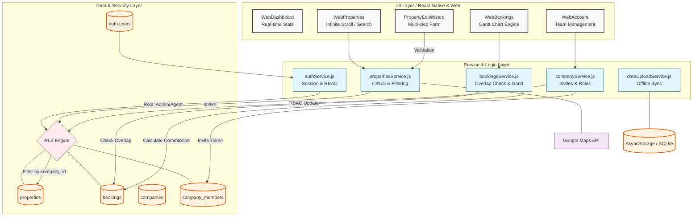

# 🏗 Архитектура и процессы I am Agent CRM

Этот документ содержит визуальные схемы системы, предназначенные для разных целей: от презентации инвесторам до технической разработки.

---

## 🎨 1. Бизнес-карта (Presentation Layer)
*Для презентаций, инвесторов и обучения новых пользователей.*

Использует фирменную цветовую палитру CRM для визуального разделения модулей.

```mermaid
graph TD
    %% Определение цветовой палитры CRM
    classDef root fill:#F5F2EB,stroke:#2C2C2C,stroke-width:3px,color:#2C2C2C,font-weight:bold;
    classDef dashboard fill:#F7E98E,stroke:#2C2C2C,stroke-width:1px,color:#2C2C2C;
    classDef properties fill:#C5E3A8,stroke:#2C2C2C,stroke-width:1px,color:#2C2C2C;
    classDef bookings fill:#A8D0E6,stroke:#2C2C2C,stroke-width:1px,color:#2C2C2C;
    classDef contacts fill:#E8B8C8,stroke:#2C2C2C,stroke-width:1px,color:#2C2C2C;
    classDef account fill:#B8A9C8,stroke:#2C2C2C,stroke-width:1px,color:#2C2C2C;
    classDef adminNode fill:#E85D4C,stroke:#fff,stroke-width:1px,color:#fff,font-style:italic;

    %% Основная структура
    Main((I am Agent<br/>Web CRM)):::root

    %% 1. Рабочая панель (Yellow style)
    Main --- Dash[<b>РАБОЧАЯ ПАНЕЛЬ</b><br/>Аналитика и KPI]:::dashboard
    Dash --- D1[Статистика компании]:::adminNode
    Dash --- D2[Мои показатели]:::dashboard
    Dash --- D3[Оперативный мониторинг]:::dashboard

    %% 2. База объектов (Green style)
    Main --- Prop[<b>БАЗА ОБЪЕКТОВ</b><br/>Property Management]:::properties
    Prop --- P1[Модерация контента]:::adminNode
    Prop --- P2[Управление ценами и комиссиями]:::properties
    Prop --- P3[Инвентарь: Резорты / Кондо / Дома]:::properties

    %% 3. Бронирования (Blue style)
    Main --- Book[<b>БРОНИРОВАНИЯ</b><br/>Booking Engine]:::bookings
    Book --- B1[Диаграмма Ганта]:::bookings
    Book --- B2[Финансовый контроль]:::adminNode
    Book --- B3[Управление статусами]:::bookings

    %% 4. Контакты (Pink style)
    Main --- CRM[<b>КОНТАКТЫ</b><br/>Unified CRM]:::contacts
    CRM --- C1[База собственников]:::contacts
    CRM --- C2[База клиентов]:::contacts
    CRM --- C3[История сделок]:::contacts

    %% 5. Аккаунт и Команда (Purple style)
    Main --- Acc[<b>КОМАНДА</b><br/>Access Control]:::account
    Acc --- A1[Матрица разрешений]:::adminNode
    Acc --- A2[Управление лимитами]:::account
    Acc --- A3[Экспорт данных]:::adminNode
    
    subgraph Legend [Легенда ролей]
        direction LR
        L1[Админ-контроль]:::adminNode
        L2[Операционная работа]:::dashboard
    end
```

---

## 🛠 2. Инженерная карта (Technical Layer)
*Для разработчиков, системных архитекторов и QA.*

Показывает взаимодействие между UI, сервисами и базой данных Supabase.

---

## 📝 Описание ключевых процессов

### 1. Жизненный цикл Объекта
*   **Создание:** Агент заполняет `PropertyEditWizard` → `propertiesService.js` отправляет данные в Supabase.
*   **Модерация:** Объект попадает в базу со статусом `pending`. Админ получает уведомление через `postgres_changes`.
*   **Одобрение:** После проверки Админом статус меняется на `approved`, и объект становится видимым для всей команды (согласно RLS).

### 2. Логика Бронирований
*   **Защита от наложений:** Перед сохранением `BookingsService` проверяет пересечение дат (`check_in`/`check_out`) для выбранного объекта.
*   **Real-time обновление:** Все изменения в таблице `bookings` мгновенно отображаются на Диаграмме Ганта у всех участников команды через WebSockets (Supabase Realtime).

### 3. Безопасность и Доступы (RBAC)
*   **RLS (Row Level Security):** Основной механизм защиты. База данных сама фильтрует строки, которые может видеть или менять пользователь, основываясь на его `auth.uid()` и `company_id`.
*   **Финансовая изоляция:** Поля комиссий собственника скрыты от обычных агентов на уровне политик безопасности.

### 4. Review Flow и модерация объектов

*   **Отправка на проверку:** Agent создаёт или редактирует объект → создаётся запись в `property_drafts` (при edit) или напрямую в `properties` (при create) → отправляется уведомление (`property_submitted` / `edit_submitted`).
*   **Review-панель:** Admin кликает на уведомление → `WebNotificationBell` загружает данные → открывает `WebPropertyEditPanel` в режиме `readOnly=true, reviewMode=true`. При `edit_submitted` мержит оригинальный объект с данными черновика.
*   **Approve/Reject:** После решения вызывается `approveProperty` / `rejectProperty` (или `Draft`-варианты). При reject — новая запись в `property_rejection_history`.
*   **Синхронизация UI:** `broadcastChange('properties')` → inter-session refresh через companyChannel. `onPropertiesChanged` callback → intra-session refresh для initiator.

### 5. История отклонений (`property_rejection_history`)

*   **Хранение:** Append-only таблица. Каждый reject добавляет новую строку; записи не обновляются и не удаляются.
*   **Связь с `properties.rejection_reason`:** Это поле хранит последнюю причину (для legacy-совместимости). В UI используется как fallback если история пуста.
*   **Refresh-механизм:** `historyRefreshKey` (local state) инкрементируется при каждом reject (из правой панели или через глобальный `refreshKey`), что гарантирует перезагрузку истории в `PropertyDetail`.

---

## 📚 Связанные документы

- [`docs/Устав компании/`](Устав%20компании/) — база знаний проекта (правила, ADR, QA-чеклисты, инциденты)
- [`docs/APP_MAP_WEB.md`](APP_MAP_WEB.md) — карта Web UI с матрицей ролей
